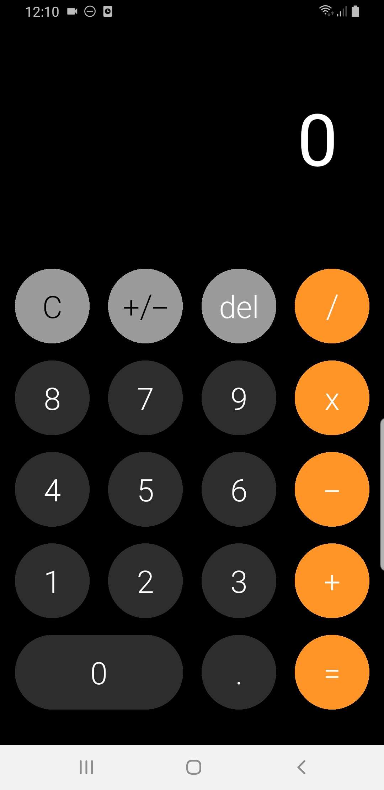

# iOS Calculator

## Descripción
Esta es una aplicación de calculadora inspirada en la interfaz de la calculadora de iOS, creada con React Native. Este proyecto es parte del curso de React Native impartido por Fernando Herrera en Udemy. La aplicación permite realizar operaciones matemáticas básicas como suma, resta, multiplicación y división con una interfaz de usuario intuitiva y atractiva.

## Instalación

### Prerrequisitos
- Node.js >= 18
- React Native CLI
- Android Studio (para desarrollo en Android) o Xcode (para desarrollo en iOS)

### Pasos
1. Clona el repositorio:
   ```bash
   git clone https://github.com/tu-usuario/iosCalculator.git
   cd iosCalculator
2. Instala las dependencias:
   ```bash
   npm install
3. Instala las dependencias:
   ```bash
   npm start
4. Para correr en Android:
   ```bash
   npm run android
5. Para correr en iOS:
   ```bash
   npm run ios

### Uso
- Abre la aplicación en tu emulador o dispositivo.
- Usa la interfaz de la calculadora para realizar operaciones matemáticas básicas.

## Capturas de Pantalla

Aquí hay algunas capturas de pantalla de la aplicación en funcionamiento:

### Pantalla Principal

<p align="center">
  
</p>
<p align="center">
  Pantalla principal de la calculadora mostrando el diseño inspirado en iOS.
</p>

## Contacto

Juandi - [GitHub](https://github.com/JuandiAndrade) - [LinkedIn](https://www.linkedin.com/in/juan-diego-andrade-polimeni-1a4501249/) - [juandi.andrade.g@gmail.com](mailto:juandi.andrade.g@gmail.com)
